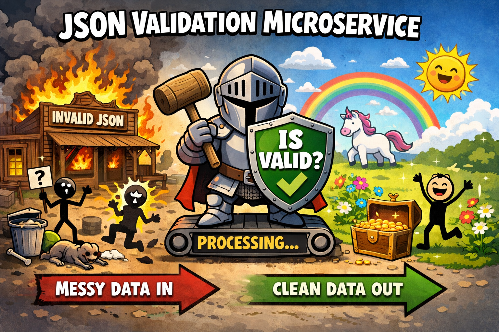
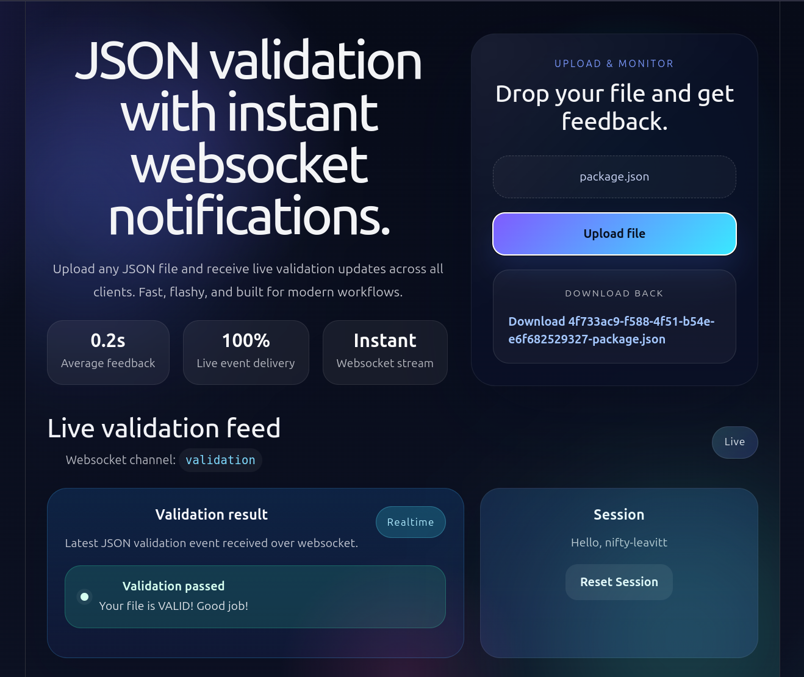
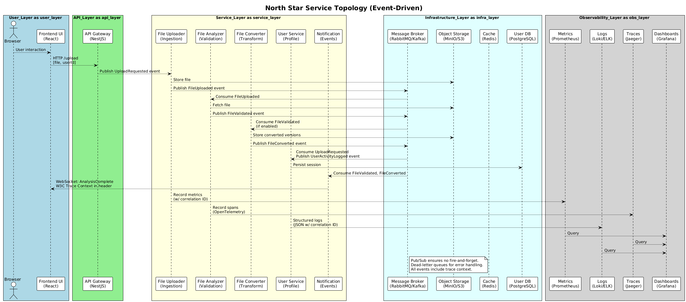

= How to complicate JSON validation

== JSONKnight

See `kiss.php`. That's all I needed to do. Now see other files.

Microservices approach for most valuable thing on the planet - JSON validation.

You can now scale your JSON validation in cloud, on premise, on lambdas, on your toaster.

I had fun over the weekend. It's not finished yet, never will be.

== Parting words

This thing is a wild idea dressed up like a microservice circus. It's not a polished enterprise product, but it is a working concept: client sees nice UI, goes through API Gateway, JSON comes in, gets judged and processed in microservice mesh, and a message flashes across sockets asynchronously. Perfection.

IMPORTANT: DO NOT USE IN PRODUCTION. IT'S A JOKE, NOT A SERVICE.

NOTE: Parts of the code were written with AI-tools, especially frontend parts (CSS, wiring sockets). Original idea was mine alone and execution/splitting and wiring for backend part was done without AI-assisted tools.
